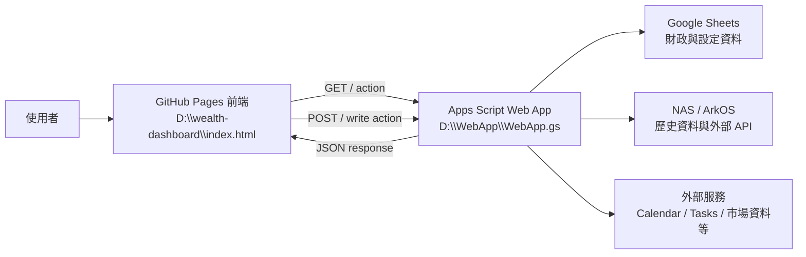

# Empire 系統地圖

> 文件狀態：目前版骨架
>
> 最後整理：2026-08-15

## 一、整體資料流



## 二、元件與責任

| 元件 | 來源或位置 | 主要責任 | 維修邊界 |
| --- | --- | --- | --- |
| 前端 | `D:\wealth-dashboard\index.html` | 畫面、分頁切換、API 呼叫、快取、使用者輸入 | 前端修改後需發布並確認正式網站 |
| Apps Script Web App | `D:\WebApp\WebApp.gs` | `doGet(e)`、`doPost(e)`、資料組合、試算表讀寫、API 回應 | 修改後需推送並確認實際部署，不只確認本機檔案 |
| Apps Script 維護工具 | `D:\WebApp\Maintenance.gs` | 維護與管理流程 | 除非功能需要，不與 Web App 業務邏輯混改 |
| Apps Script manifest | `D:\WebApp\appsscript.json` | 時區、權限、Tasks Advanced Service、Web App 執行方式 | 變更權限或部署設定後需重新驗證 |
| Google Sheets | 線上試算表 | 原始資料、公式、設定與歷史紀錄 | 公式儲存格不可直接覆蓋；先確認上游來源 |
| NAS / ArkOS | `D:\ArkOS26`、NAS | 歷史檔案、Wall 與部分 API 資料 | 需確認服務/API 實際狀態 |
| GitHub Pages | `D:\wealth-dashboard` | 前端正式發布 | Git push 不等於正式網站已完成更新 |

## 三、目前已知的前端區塊

以下是分類入口，詳細功能會分別移到 `blocks/` 下的文件；目前只做導航，不在系統地圖複製全部實作細節。

| 區塊 | 前端入口或概念 | 主要後端 / 資料依賴 | 文件狀態 |
| --- | --- | --- | --- |
| [財政](./blocks/財政/README.md) | 財政面板、月度、年度、持股、現金流 | Google Sheets、Apps Script、NAS 歷史財務資料 | 第一版 |
| [內政](./blocks/內政/README.md) | 快速記帳、交易、最近記錄、持股備忘錄 | Google Sheets、Apps Script、外部資料庫 | 第一版 |
| [軍機處](./blocks/軍機處/README.md) | 戰情總匯報、部隊陣容、台美股大盤、美股總經 | Google Sheets、Apps Script、外部市場資料 | 第一版 |
| [醫館](./blocks/醫館/README.md) | 健康快記、抽牌記錄、牌卡統計、疼痛地圖 | 醫療 Google Sheets、Apps Script、獨立健康日誌 | 第一版 |
| [司天監](./blocks/司天監/README.md) | 命盤總覽、事件編年 | 獨立紫微試算表、主試算表、Apps Script | 第一版 |
| [城牆](./blocks/城牆/README.md) | 生活日記、備忘隨筆、股市教室、時光長廊 | ArkOS26 API、NAS、Synology Photos | 第一版 |
| [龐統軍師](./blocks/龐統軍師/README.md) | AI 指令、快速記帳、財務查詢、確認寫入、每日提醒 | Apps Script、Google Sheets、DeepSeek、Calendar／Tasks | 目前版 |
| [今日政務](./blocks/今日政務/README.md) | 本月月曆指定日期行程、今日／明日／七日行程、未完成待辦、行程與待辦管理 | Apps Script CalendarApp、Tasks Advanced Service、Google Calendar／Tasks | 第一版 |
| [帝國晨報](./blocks/帝國晨報/README.md) | 流動性、經濟、通膨、信用與 30 日戰略報告 | 外部資料試算表、Apps Script、DeepSeek、Apps Script Trigger | 第一版 |
| 行事曆與任務 | 行事曆、待辦與每日安排 | Apps Script、Google Calendar、Tasks | 待建立 |
| 市場與總經 | 市場儀表板、總經資料 | Apps Script、外部市場資料 | 待建立 |
| Wall / 日誌 | Wall、備忘錄、照片或歷史內容 | ArkOS / NAS API | 待建立 |
| 生活功能 | 醫療、會員、星星等個人區塊 | Apps Script、前端資料或外部服務 | 待建立 |

## 四、Apps Script API 邊界

`WebApp.gs` 以 `doGet(e)` 與 `doPost(e)` 作為 Web App 入口。各區塊文件應記錄自己使用的 `action`、請求參數、回應形狀與是否為寫入操作。

目前可作為索引的 API action 包含：

| action | 用途分類 | 詳細文件 |
| --- | --- | --- |
| `config` | 前端設定與選項 | [財政區塊](./blocks/財政/README.md) |
| `monthly` | 月度財政資料 | [財政區塊](./blocks/財政/README.md) |
| `yearly` | 年度財政資料 | [財政區塊](./blocks/財政/README.md) |
| `legacyMonthDetails` | 舊版月份明細 | [財政區塊](./blocks/財政/README.md) |
| `accounts` | 帳戶資料 | [財政區塊](./blocks/財政/README.md) |
| `holdingsOverview` | 持股總覽 | [財政區塊](./blocks/財政/README.md) |
| `battleBrief` | 戰情總匯報 | [軍機處](./blocks/軍機處/README.md) |
| `councilPantry` | 糧倉摘要 | [軍機處](./blocks/軍機處/README.md) |
| `marketDashboard` | 市場儀表板 | [軍機處](./blocks/軍機處/README.md) |
| `macroOverview` | 總經資料 | [軍機處](./blocks/軍機處/README.md) |
| `ziweiCharts` | 紫微命盤資料 | [司天監](./blocks/司天監/README.md) |
| `eventChronicle` | 事件編年史 | [司天監](./blocks/司天監/README.md) |
| `/api/expeditions` | 城牆紀錄列表 | [城牆](./blocks/城牆/README.md) |
| `/api/expeditions/:id` | 城牆單篇詳情 | [城牆](./blocks/城牆/README.md) |
| `/api/photo-library/*` | NAS 影像索引 | [城牆](./blocks/城牆/README.md) |
| `todayAdvisorReminder` | 今日軍師提醒 | [龐統軍師](./blocks/龐統軍師/README.md) |
| `advisorAiParse` | 自然語句轉安全 JSON 指令 | [龐統軍師](./blocks/龐統軍師/README.md) |
| `advisorDividendMemo` | 配息備忘試算／寫入 | [龐統軍師](./blocks/龐統軍師/README.md) |
| `expense`、`income`、`transfer` | 軍師財務寫入 | [龐統軍師](./blocks/龐統軍師/README.md) |
| `todayCalendar`、`todayTasks` | 今日政務與指定日期行程讀取 | [今日政務](./blocks/今日政務/README.md) |
| `calendarCreate`、`calendarDelete` | 行程管理 | [今日政務](./blocks/今日政務/README.md) |
| `taskCreate`、`taskDelete` | 待辦管理 | [今日政務](./blocks/今日政務/README.md) |
| `macroLongReport` | 30 日戰略報告讀取 | [帝國晨報](./blocks/帝國晨報/README.md) |
| `macroLongReportGenerate` | 產生 30 日戰略報告 | [帝國晨報](./blocks/帝國晨報/README.md) |
| `macroLongReportTriggerInstall`、`macroLongReportTriggerStatus` | 長期報告排程管理 | [帝國晨報](./blocks/帝國晨報/README.md) |
| `pledgeLoans` | 質押與貸款 | [財政區塊](./blocks/財政/README.md) |
| `transactions` | 交易資料 | [財政區塊](./blocks/財政/README.md) |

## 五、資料來源層級

```text
Google Sheets / NAS 原始資料
        ↓
Apps Script 整理、驗證、快取與寫入
        ↓
正式 Web App API
        ↓
wealth-dashboard 前端渲染與互動
        ↓
GitHub Pages 正式網站
```

特殊情況：歷史年度財務資料可能由 NAS archive 提供，當年度資料則可能走 Apps Script；實際使用方式應記錄在財政區塊文件，不能只從畫面推測。

## 六、發布與驗證分界

### Apps Script

```text
修改 D:\WebApp\WebApp.gs
        ↓
clasp push -f / 正式部署更新
        ↓
驗證正式 GET
        ↓
驗證寫入型 POST 或其他 write action
        ↓
必要時回查試算表或資料紀錄
```

GET 成功不代表 POST 或寫入操作已成功；若寫入請求逾時，應先查詢資料是否已寫入，再決定是否重試。

### GitHub Pages

```text
修改 D:\wealth-dashboard\index.html
        ↓
提交並推送 frontend repository
        ↓
等待 Pages build
        ↓
抓取正式網站 HTML / API 行為
        ↓
確認正式網址的畫面與功能
```

## 七、排程與快取

排程不是單純的程式碼註解。每個排程都要同時記錄：

- 觸發器名稱與時間，例如每日 09:00。
- 執行的 Apps Script 函式或外部服務。
- 讀取與寫入的試算表分頁或 NAS 路徑。
- 失敗時的錯誤處理與重跑方式。
- 最後一次實際驗證時間。

目前排程索引尚未建立，暫不把「每日 09:00」列為已確認事實；待建立 `operations/排程.md` 時再逐一從觸發器與執行紀錄核對。

## 八、維修時的最小檢查

1. 先確認要修改的是前端、Apps Script、試算表還是 NAS。
2. 找到該元件的區塊文件與資料來源。
3. 讀取現況，尤其是公式儲存格與正式 API 結果。
4. 只修改使用者指定的最小範圍。
5. 按照上方發布流程分別驗證各層。
6. 把新函式、API、範圍、排程或風險補回對應文件。

## 九、部隊配置每日快照

- 資料來源：`月度戰情室` 持股現值，依部隊陣容既有四種分組加總。
- 寫入目的地：外部 `⬇️總經室` 試算表的 `部隊配置每日快照` 分頁。
- 後端：`recordDailyAssetSnapshot()` 同步呼叫 `recordDailyCouncilRosterSnapshot()`；讀取 API 為 `councilRosterSnapshot`。
- 前端：`D:\wealth-dashboard\index.html` 的部隊兵力配置比例，在各組加總現值後顯示相對昨天快照的增減金額；昨天沒有快照時顯示等待狀態。
