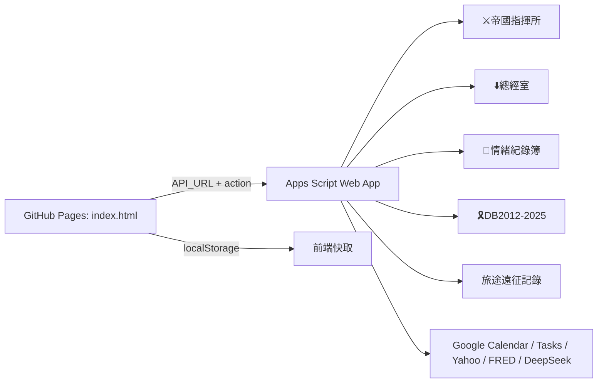

# Web 開發日誌

更新日期：2026-07-27  
範圍：`D:\wealth-dashboard` GitHub Pages 前端、`D:\WebApp` Apps Script 後端、Google Sheets 資料層與發布流程。

> 之後只要修 Web、Apps Script、Google Sheets、GitHub Pages 或日常軍師工單，就先讀這一份。不要再讀舊混合日誌。

## 1. 專案定位

Web 端是 Empire Command / wealth-dashboard 的主要控制台。它由 GitHub Pages 前端、Apps Script Web App 後端與多本 Google 試算表組成。

| 層級 | 正式來源 |
| --- | --- |
| 前端 | `D:\wealth-dashboard\index.html` |
| 後端 | `D:\WebApp\WebApp.gs` |
| 維護工具 | `D:\WebApp\Maintenance.gs` |
| Apps Script manifest | `D:\WebApp\appsscript.json` |
| 前端 repo 內鏡像後端 | `D:\wealth-dashboard\WebApp.gs`，只作對照，不是部署來源 |

重要邊界：

- 不要在 `D:\WebApp` 新建或恢復 `index.html` 來改前端。
- 前端發布和後端部署是兩件事，兩邊都要各自驗證 live 狀態。
- 試算表資料、公式與 Apps Script API 彼此相依，改格子前要先確認來源。
- 舊檔、舊路徑和 `_legacy_reference/` 只作參考，除非主公明確要求，不要修改。

## 2. 目前系統架構



## 3. 主要工作簿

| 工作簿 | 用途 |
| --- | --- |
| `⚔️帝國指揮所` | 主帳務、月度戰情、年度財報、事件編年、前端設定 |
| `⬇️總經室` | 市場儀表板、總經資料、配息備忘、持股交易備忘、每日資產快照 |
| `🤕情緒紀錄簿` | 醫館紀錄、牌卡統計、疼痛地圖、紫微星盤 |
| `🎗️DB2012-2025` | 舊帳年度與月明細查詢 |
| `旅途遠征記錄` | 景點、交通、住宿與地圖資料 |

## 4. 前端現況

首頁卡片：

| 卡片 | 入口 |
| --- | --- |
| 財政 | 國庫現況、糧倉會報、年度財報、配息試算 |
| 內政 | 快速記帳、最近記錄、持股備忘錄 |
| 市集 | 市場快報、總經戰情 |
| 軍機處 | 部隊陣容、軍團概覽 |
| 醫館 | 快速記錄、抽牌記錄、牌卡統計、疼痛地圖 |
| 司天監 | 命盤總覽、事件編年 |
| 城牆 | ArkOS Wall / 照片影片素材庫 |

前端設定：

| 設定 | 用途 |
| --- | --- |
| 主 Web App API URL | 財富儀表板、收支、轉帳、軍師工單、總經、今日政務 |
| `WRITE_TOKEN` | 財務與其他寫入操作 |
| 醫館 API URL / SECRET_KEY | 舊醫館專用設定；若功能異常，先查目前前端實際是否仍使用 |

核心前端函式：

| 區域 | 主要函式 |
| --- | --- |
| 面板開啟 | `openPanel(key)` |
| API helper | `apiGet()`、`apiPost()`、`apiPostJson()` |
| 財政 | `renderFinancePanel()` |
| 醫館 | `renderMedicalPanel()` |
| 司天監 | `renderStarsPanel()` |
| 城牆 | `openArkWall()` 系列 |
| 軍師 AI | `advisorAICommand()`、`advisorAIOpenTarget()`、`advisorAIRequireWrite()` |

重要快取：

| key | 用途 |
| --- | --- |
| `wealth_finance_treasury_v6` | 國庫現況 |
| `wealth_finance_pledge_v2` | 質押/信貸 |
| `wealth_finance_yearly_v3_YYYY` | 年度財報 |
| `wealth_finance_month_detail_v1_YYYY-MM` | 年度財報月明細 |
| `wealth_market_dashboard_v1` | 市場快報 |
| `wealth_market_macro_v1` | 總經戰情 |
| `empire_advisor_ai_parse_v1_...` | 軍師 AI 指令解析 |

## 5. 後端 API 現況

`WebApp.gs` 以 `doGet(e)` / `doPost(e)` 對外提供 API，回應使用 `{ok:true,data:...}` 或錯誤包裝。

常用讀取 action：

| action | 功能 |
| --- | --- |
| `config` | 表單選項、帳戶、來源與持股設定 |
| `monthly` | 月度收入、支出、配息 |
| `yearly` | 年度財報 |
| `legacyMonthDetails` | 舊帳單月明細 |
| `accounts` | 國庫帳戶 |
| `holdingsOverview` | 持股與部隊概要 |
| `foodhouseDashboard` | 糧倉會報 |
| `marketDashboard` | 市場快報 |
| `macroOverview` | 總經戰情 |
| `pledgeLoans` | 質押與信貸 |
| `transactions` | 最近記錄 |
| `dividendCenter` | 持股備忘 |
| `ziweiCharts` | 紫微星盤 |
| `eventChronicle` | 事件編年 |
| `todayCalendar` / `todayTasks` | 今日政務 |

常用寫入 action：

| action | 功能 |
| --- | --- |
| `verifyWriteToken` | 驗證寫入密鑰 |
| `expense` / `income` / `transfer` | 記帳與轉帳 |
| `transactionUndo` | 最近記錄撤銷 |
| `stockTradeVoid` | 股票交易作廢 |
| `divCalc` | 配息試算寫入 |
| `dividendEntry` / `dividendDelete` | 配息備忘 |
| `holdingTradeEntry` / `holdingTradeDelete` | 持股交易備忘 |
| `medicalQuickRecord` / `medicalTarotRecord` | 醫館寫入 |
| `advisorAiParse` | DeepSeek 指令解析 |
| `macroWebhook` / `marketDashboardRefresh` | 總經與市場維護 |

## 6. 部署流程

### 修改前快速規則

- 先用 `rg` 定位函式或文字，不要整檔重讀。
- 只改 active 檔：`D:\wealth-dashboard\index.html`、`D:\WebApp\WebApp.gs`、`D:\WebApp\Maintenance.gs`。
- 改 UI 前先確認目標面板與 selector，尤其是諸葛亮軍師 dialog 與龐統 AI panel 容易混淆。
- 完成後跑語法檢查；發布任務還要驗證 live endpoint 或 live HTML。

### 前端 GitHub Pages

```powershell
cd D:\wealth-dashboard
git diff --check
git add index.html
git commit -m "..."
git push origin main
gh run list --repo artery526/wealth-dashboard --workflow pages-build-deployment --limit 5
gh run watch <run-id> --repo artery526/wealth-dashboard --exit-status
```

發布後要讀公開 HTML marker，確認 live 頁真的更新：

- `https://artery526.github.io/wealth-dashboard/`
- `https://command.ark-os26.cc/`

前端語法檢查：

```powershell
cd D:\wealth-dashboard
node -e "const fs=require('fs'); const html=fs.readFileSync('index.html','utf8'); const scripts=[...html.matchAll(/<script>([\s\S]*?)<\/script>/g)].map(m=>m[1]); scripts.forEach((s,i)=>new Function(s)); console.log('index.html scripts syntax ok:', scripts.length)"
```

### Apps Script 後端

```powershell
cd D:\WebApp
clasp.cmd push -f
clasp.cmd version "..."
clasp.cmd deployments
clasp.cmd deploy --deploymentId <existing-id> --versionNumber <version> --description "..."
```

部署後要打 live endpoint 驗證實際 action，不只看本機檔案。

Apps Script 語法檢查：

```powershell
cd D:\WebApp
node -e "const fs=require('fs'); new Function(fs.readFileSync('WebApp.gs','utf8')); console.log('WebApp.gs syntax ok')"
node -e "const fs=require('fs'); new Function(fs.readFileSync('WebApp.gs','utf8')+'\n'+fs.readFileSync('Maintenance.gs','utf8')); console.log('Apps Script syntax ok')"
```

### 軍師工單流程

主公通常會說「軍師執行最新工單」。

1. 讀 Google Sheet `軍師工單!A:I`。
2. 找最後一筆 `狀態 = 待處理`。
3. 依 `修改目標` 和 `相關區域` 處理。
4. 改 active 檔或試算表。
5. 跑驗證。
6. 回寫該列：`狀態 = 已處理`，`處理備註 = 實際修改內容 + 驗證結果`。

`軍師工單` sheetId：`1900001001`

## 7. 開發紀錄

### 2026-04 至 2026-05

- 建立帝國指揮所財務網站主體。
- 完成記帳、帳戶餘額、年度戰情室、持股總覽、配息試算、質押信貸、市場觀測等早期功能。
- 醫館功能曾獨立使用醫館 API，後續已逐步整合進主 WebApp。
- 舊路徑如 `D:\綜合型網頁`、`D:\🪙糧草 dashboard` 已不再作為目前開發依據。

### 2026-07-07

- 完成一次 Web 架構盤點。
- 明確確認前端 source of truth 是 `D:\wealth-dashboard\index.html`。
- 明確確認 Apps Script 後端 source of truth 是 `D:\WebApp\WebApp.gs`。
- 建立 WebApp / frontend / Sheets / deployment 邊界。

### 2026-07-16 至 2026-07-21

- 年度財報舊年度載入與 race condition 修正。
- 事件編年 schema、快取與顯示調整。
- 軍師選單、龐統 AI 面板快捷入口多次調整。
- Finance UI 摺疊、交易備忘、醫館快速記錄與 Pages 發布流程驗證。

### 2026-07-22 至 2026-07-23

- Wall memo 搜尋與素材庫整合。
- ArkOS photo-library API 與 Web 前端 Wall overlay 對接。
- 影片上傳/播放與 HEIC 縮圖修復流程建立。
- Android 與 Web 的 Wall renderer 分別修正，避免誤以為兩端共用行為。

### 2026-07-25

- Finance / Pangtong advisor AI 維護。
- 保留寫入 token 保護，移除不必要 passcode gate。
- Monthly Income 與年度財報相關讀取改用較精準查找，避免冷啟動全表掃描。
- DeepSeek fallback 與本地 alias parser 修正。

### 2026-07-27

- Web 筆記整理為本檔。
- 舊混合日誌清空為導向頁，不再作為最新開發依據。

### 2026-07-29

- 配息中心匯率來源改為 `月度戰情室!H1`，不再讀 `設定!L2`。
- `設定` 分頁已清除未連結資料，只保留支出類別、收入來源與財富狀態規則。
- 持股/部隊對照固定以 `月度戰情室!A13:A24` 為準，不再讀 `設定!H12:H23`。

### 2026-07-30

- 首頁軍師區下方、財政/內政卡上方新增本月月曆與今日政務模組。
- 月曆以本地日期生成並深色標示今天；今日政務沿用 `todayCalendar` 顯示今日行程，`todayTasks` 顯示所有未完成待辦，不限定日期。
- 後端既有 Calendar / Tasks route 未改動；若授權或 API URL 缺失，首頁模組顯示龐統網頁驗證提示。

### 2026-07-31

- 首頁「本月月曆」標題旁新增當天農曆日期，沿用瀏覽器 `zh-TW-u-ca-chinese` 農曆格式。
- 首頁「今日政務」旁新增「帝國晨報」切換；晨報模式重用諸葛軍師 `advisorWorldBuild()` / `advisorWorldHtml()` 與市場/總經快取，不新增後端 route。
- 諸葛軍師入口整理：試算表連結搬到龐統工具列「影片下載」旁；天氣搬到首頁「今日政務」日期旁；首頁軍師動態入口只保留龐統。
- 修正首頁今日政務欄位在行程清單較長時，右側待辦 section 因 CSS grid 預設 stretch 被撐出大空白；首頁 section 改為 `align-content:start`。
- 財政 > 配息試算改為純前台即時計算；移除寫入後台 `配息試算` 表與近期試算 localStorage，介面改用投入金額、股價自動反推可購買股數並計算月配息。
- 龐統軍師工具列「打開試算表」改名為「進入資料庫」，並於其下方新增「配息試算」按鈕，導向財政 > 配息試算。
- 財政面板手機版年度目標 HUD 由橫向捲動改為 2x2 兩列顯示，避免年化報酬率與財富狀態被截掉。
- 龐統軍師「進入資料庫」試算表連結改為 `gid=482251636`，預設開啟 `資料庫` 分頁，不再停留於 `設定` 分頁。
- Apps Script 新增只讀 `databasePosition` route 回傳 `資料庫` 分頁 gid 與最後列；龐統軍師「進入資料庫」按鈕會先開資料庫，再導向 `range=A最後列`。

## 8. 目前注意事項

- `WRITE_TOKEN` fallback 仍在原始碼中，長期建議改為只使用 Script Properties。
- 部分 GET 寫入 route 仍存在，方便前端但安全性較弱。
- `Maintenance.gs` 有重複命名函式，執行前要確認實際生效版本。
- GitHub Pages 是 legacy Pages，push 後仍要等 Pages build 並讀 live HTML。
- PowerShell 顯示中文可能亂碼，修改時優先使用穩定 function name、id、action name。
- 對 Google Sheets 動手前，先確認是公式來源格還是顯示格，不要覆蓋公式。
- 今日政務若改到 Calendar / Tasks 權限，可能需要先在 Apps Script 手動跑授權函式再重新部署。
- 總經自動化由 `dailyMacroBriefing` 串 Yahoo/FRED、DeepSeek 與 `writeMacroWebhook`；排程函式是 `installDailyMacroTrigger()`。
- 配息中心匯率固定讀 `月度戰情室!H1`；不要再用 `設定!L2`。
- 持股/部隊清單固定讀 `月度戰情室!A13:A24`；不要再用 `設定!H12:H23`。

## 9. 下一步建議

- 建立前端函式對後端 action 的索引。
- 建立最小 Playwright smoke test：財政、快速記帳、醫館、市場、Wall。
- 把 `WebApp.gs` action registry 或註解區整理出來，降低單檔維護成本。
- 把主要試算表 schema 另存成表格文件，包含欄位、公式與 API 依賴。

## 10. 讀檔規則

Web 相關任務只需要先讀：

1. `D:\WebApp\WEB_DEV_LOG.md`
2. 任務目標附近的 active 檔片段

一般情況不要再讀其它根目錄筆記。App 任務才讀 `APP_DEV_LOG.md`。

### 2026-08-01

- Wall frontend: moved the year/month article filter below the selected-month article list and above the Time Corridor block in `D:\wealth-dashboard\index.html`.
